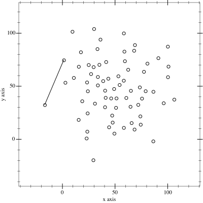

Calculates the convex hull of a given set of points. Monotone chain is used as algorithm.

## Info

Given a set of points, the convex hull is a subset of points which form a polygon that encloses all points. It does that using [Andrew's monotone chain algorithm]() which has an efficient O(n log n) runtime.


(Maonus, [CC BY-SA 4.0](https://creativecommons.org/licenses/by-sa/4.0), via Wikimedia Commons)

## Usage

```dart
import 'package:convex_hull/convex_hull.dart';

const points = [
    Point2d(1, 2),
    Point2d(3.2, 1),
    Point3d(1.3, 1),
]
const hull = convexHull(points);
```
